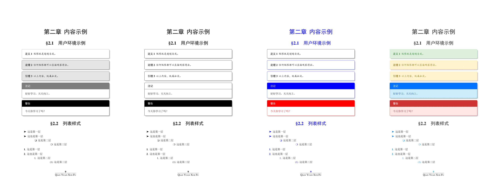
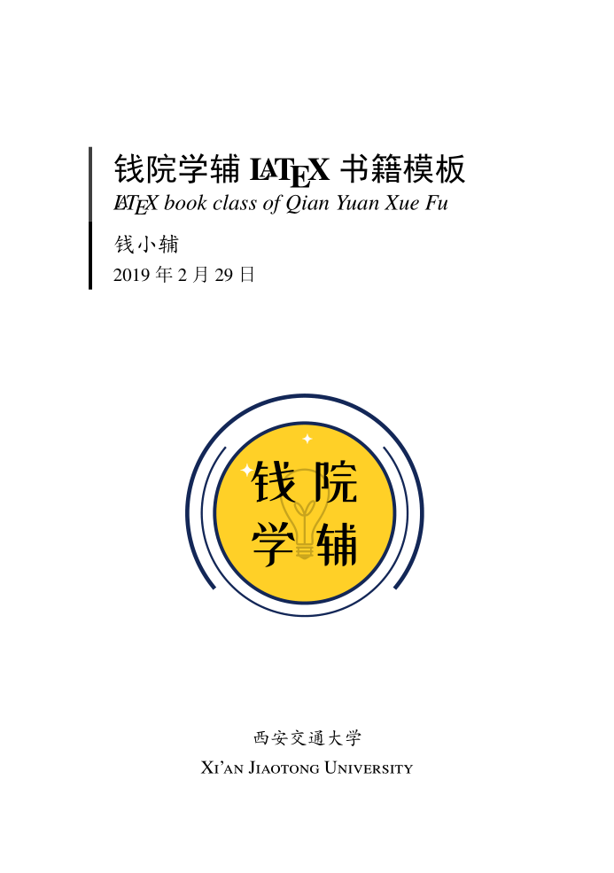

# 钱院学辅 LaTeX 书籍模板

`qyxf-book` 是由钱院学辅开发的、用于排版中等以上体量资料的 LaTeX 文类。目前，该模板已被用于编写了[《大学物理题解》](https://github.com/qyxf/university-physics)、《理论力学题解》、[《计算方法撷英》](https://qyxf.site/2019/11/26/notes-on-computing-methods-published)等诸多资料。

本份模板原在 [qyxf-sets 宏集](https://github.com/qyxf/qyxf-sets)项目中开发；因维护成本过高、效果不理想，现独立维护，并不再使用之前的 doc/doctrip 方式。现采用 MIT 协议许可，请大家放心地 fork、修改。

## 特点

- 样式简洁、干净，适于排版学习资料；
- 提供了多种配色方案，用户可在此基础上自行定制；
- 提供了其他易用接口，以定制封面、正文样式。

## 使用说明

目录下附带一份样例代码 `demo.tex`（在 CTAN 发行的版本中为 `qyxf-book-doc.tex`），编译即可得模板说明书及内容示例，请根据代码和编译得到的说明书学习使用本模板。

## 发布平台

模板分别在：

- Gitee：<https://gitee.com/qyxf/qyxf-book>
- GitHub：<https://github.com/qyxf/qyxf-book>
- CTAN：<https://www.ctan.org/pkg/qyxf-book>

发布，Gitee 为主要开发平台，后两者更新稍慢（CTAN 上的代码目录结构、文件名称与另两者略有区别）。